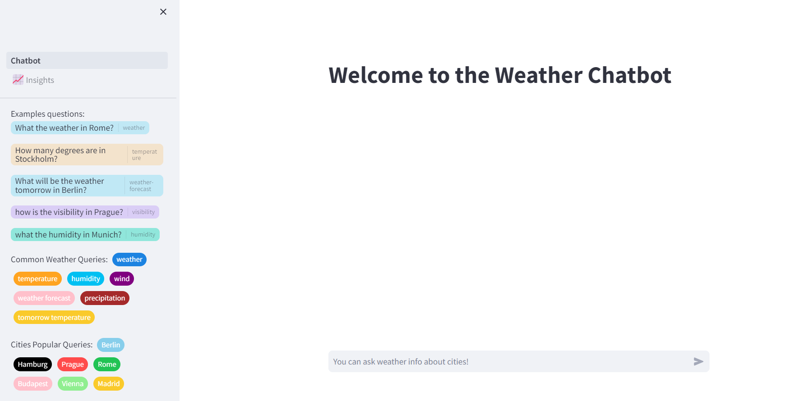

# Streamlit Chatbot Weather Application with RASA and Python-Weather

In order to run the application locally you need to follow these steps:

1- Open Command Line Tool and clone the repository in your machine:
https://github.com/nferrari3444/weatherchatbot

2- In the weatherchatbot directory, create a virtural environment: python -m venv .venv

3- Activate the virtual environment. In the same directory, write the following: .venv\Scripts\activate.bat

4- Install all required libraries in the Virtual Environment with
pip install -r requirements.txt

5- Before run the application, we need to run the RASA server. This will allow our application to send request to the RASA server. For this purpose, open a new terminal, activate Virtual Environment and in the project root write the following commando: rasa run --enable-api

6- The previous step will run the RASA server in localhost where the last trained model is loaded. This allow us to use some RASA endpoints that the framework provide in order to parse user queries, etc.

7- Once the RASA server is running, we need to launch our application. The entrypoint of our Streamlit application is Chatboy.py. The command to start the applicatin is: Streamlit run Chatbot.py

8- A new window in the browser will be opened with our application. Now you are able to interact and start to make questions to our bot.

